# 📡 Telco Customer Churn Prediction

[](https://github.com/Yahya-osama-mohmamed/telco-churn-prediction/actions/workflows/ci.yml)
[](https://www.python.org/downloads/release/python-3110/)
[](https://opensource.org/licenses/MIT)

An end-to-end Machine Learning project to predict telecom customer churn. This repository contains a production-ready ML pipeline, a FastAPI REST service, a Streamlit dashboard, and complete deployment configurations.

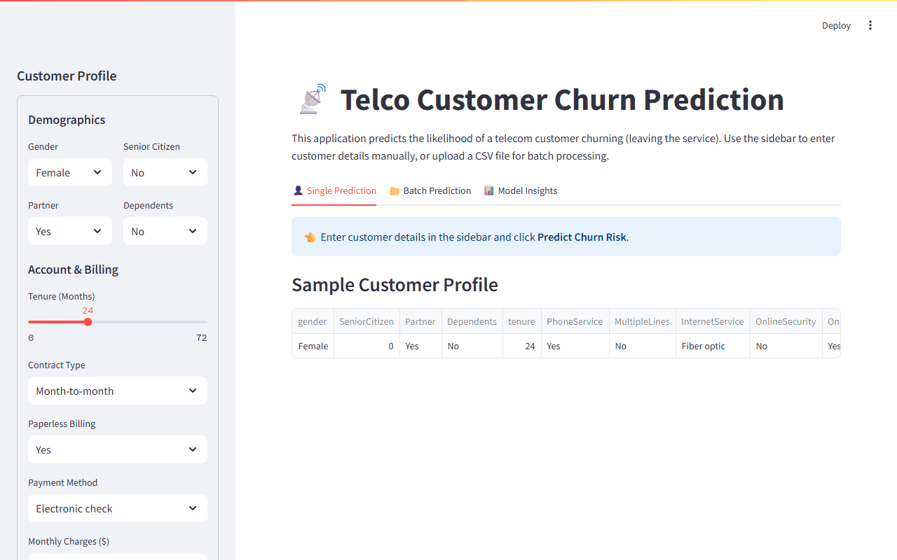

*Live dashboard: enter a customer profile → churn probability gauge + per-prediction SHAP explanation.*

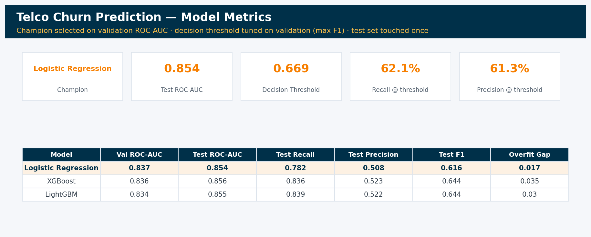


## 🎯 Business Problem

Customer churn (attrition) is one of the most critical challenges for telecom companies. Acquiring a new customer costs **5–25x** more than retaining an existing one. This project builds a predictive system that identifies customers with a high probability of churning, enabling proactive and targeted retention campaigns.

**Dataset:** [IBM Telco Customer Churn](https://www.kaggle.com/datasets/blastchar/telco-customer-churn)  
(7,043 customers, 21 features covering demographics, account info, and services).

---

## 🛠️ Tech Stack

- **Data Science Core:** pandas, NumPy, scikit-learn
- **Machine Learning Models:** XGBoost, LightGBM, Logistic Regression
- **Explainability:** SHAP (SHapley Additive exPlanations)
- **Experiment Tracking:** MLflow
- **API & Backend:** FastAPI, Uvicorn, Pydantic
- **Frontend / Dashboard:** Streamlit, Plotly
- **DevOps / CI-CD:** Docker, Docker Compose, GitHub Actions, Render
- **Testing:** Pytest

---

## 🚀 Quick Start

### 1. Local Setup (Without Docker)

Clone the repository and install dependencies:
```bash
git clone https://github.com/Yahya-osama-mohmamed/telco-churn-prediction.git
cd telco-churn-prediction
python -m venv venv
source venv/bin/activate  # On Windows: venv\Scripts\activate
pip install -r requirements.txt
```

### 2. Run the analysis
The whole project is one notebook: [`notebooks/churn_analysis.ipynb`](notebooks/churn_analysis.ipynb).
It downloads the dataset, cleans it, splits before fitting anything, engineers
features, compares three model families, tunes the decision threshold, opens the
test set once, runs SHAP, and saves the artifacts the API serves.

```bash
jupyter lab notebooks/churn_analysis.ipynb
```

Or execute it headlessly:

```bash
jupyter nbconvert --to notebook --execute --inplace notebooks/churn_analysis.ipynb
```

### 3. Browse the tracked experiments

Every tuning run is logged to a local MLflow store — hyperparameters, CV and
validation scores, full test metrics, and the champion's serialized pipeline.

```bash
mlflow ui --backend-store-uri mlruns
```

### 4. Start the Applications
**FastAPI Backend (Port 8000):**
```bash
uvicorn app.api:app --reload
```
Swagger documentation available at: http://localhost:8000/docs

**Streamlit Dashboard (Port 8501):**
```bash
streamlit run app/streamlit_app.py
```

---

## 🐳 Docker Setup

You can run the entire application stack using Docker Compose. The notebook must be run at least once locally to generate the `models/` directory before starting the containers.

```bash
# Start both API and Streamlit containers
docker-compose up --build -d

# Check logs
docker-compose logs -f
```

---

## 📂 Project Structure

```
.
├── app/                    # Deployment Layer
│   ├── api.py              # FastAPI application
│   ├── schemas.py          # Pydantic models
│   └── streamlit_app.py    # Streamlit dashboard
├── data/                   # Data directory (ignored in git)
│   ├── raw/                # Original downloaded dataset
│   └── processed/          # Cleaned & split data
├── dashboard/              # Power BI dashboard (PBIP project format)
├── figures/                # EDA and SHAP visualizations (written by the notebook)
├── mlruns/                 # MLflow tracking store (gitignored)
├── models/                 # Saved pipeline, feature names, model metadata
├── notebooks/
│   └── churn_analysis.ipynb  # ← the project: EDA → features → models → threshold → SHAP
├── reports/                # Model comparison table
├── tests/                  # Pytest unit tests
├── pipeline_lib.py         # Custom transformers shared by the notebook and the API
├── Dockerfile              # Multi-purpose Dockerfile
├── docker-compose.yml      # Container orchestration
├── render.yaml             # Render cloud deployment config
└── requirements.txt        # Python dependencies
```

### Why there is still a `.py` file

`pipeline_lib.py` holds the two custom transformers (`FeatureEngineer`,
`BinaryEncoder`) and the column definitions. Not for tidiness — a pickled
sklearn pipeline stores its steps *by import path*, so a transformer defined in
a notebook pickles as `__main__.FeatureEngineer` and the API can never load it.
Everything else — loading, EDA, splitting, tuning, evaluation, explainability —
lives in the notebook.

---

## 📊 Model Performance

After running the notebook, check `reports/model_comparison.csv` for detailed metrics.

The champion is chosen on the validation set. All three families land within a
few thousandths of each other, so the tiebreaker is interpretability and
training cost — which is why the linear model ships:

| Model | Val ROC-AUC | Test ROC-AUC |
|---|---|---|
| **Logistic Regression** (champion) | **0.8367** | **0.8538** |
| XGBoost | 0.8356 | 0.8555 |
| LightGBM | 0.8339 | 0.8548 |

At the tuned threshold of **0.669**, the served model scores accuracy 0.796,
precision 0.613, recall 0.621, F1 0.617 on the held-out test set.

### Methodology Notes

- **Model selection** uses the validation set (15%); the test set (15%) is reserved
  strictly for the final unbiased performance estimate.
- **Feature engineering lives inside the sklearn Pipeline** (`FeatureEngineer` step in `pipeline_lib.py`),
  so statistics such as the MonthlyCharges median used by `high_value_short_tenure`
  are learned from training folds only. The saved `models/final_pipeline.joblib`
  accepts raw customer records — no manual feature engineering is needed at serving time.
- **The decision threshold** is tuned on the validation set (maximizing F1) and stored
  in `models/model_metadata.json`; the API applies it automatically instead of a
  hardcoded 0.5.
- **Mutual information** is used to sanity-check feature signal before modeling
  (`figures/feature_selection_mi.png`); models still train on the full feature set.

### Feature Importance (SHAP)
Top drivers of churn identified by the model:
1. **Contract Type:** Month-to-month contracts have vastly higher churn rates.
2. **Tenure:** Shorter tenure indicates higher risk.
3. **Internet Service:** Fiber optic customers show unexpectedly high churn (potential service quality issue).
4. **Total / Monthly Charges:** Higher charges correlate with higher churn.

---

## 📊 Power BI Dashboard — Customer Retention Command Center

A four-page interactive Power BI dashboard (plus a full dark-mode twin of every
page) built on the model's scored output:

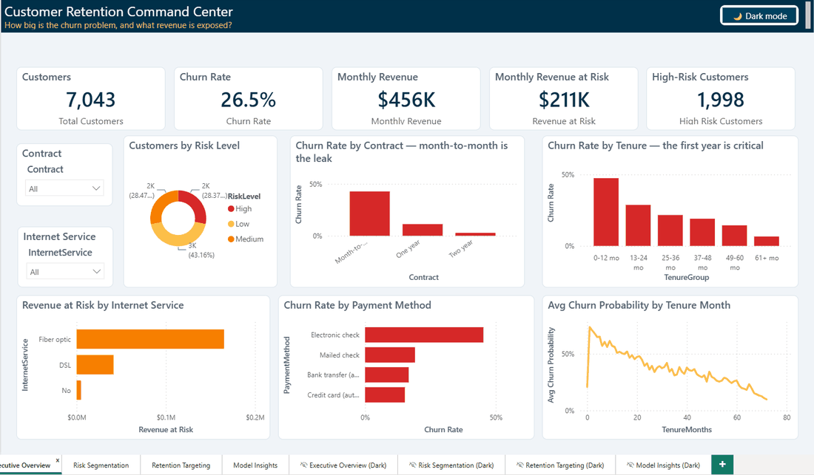

*Live usage: KPI cards and every visual cross-filter from the Contract slicer,
four story pages (Executive Overview → Risk Segmentation → Retention Targeting →
Model Insights), and a **dark-mode toggle button** that switches the entire
report between light and dark themes (palette: `#003049 / #D62828 / #F77F00 /
#FCBF49`).*

- **Executive Overview** — how big is the churn problem, and what revenue is exposed?
- **Risk Segmentation** — where does churn concentrate? Slice any dimension.
- **Retention Targeting** — a ranked retention call list with savable revenue.
- **Model Insights** — champion model card, SHAP drivers, and calibration, so
  stakeholders can trust the scores.

Open `dashboard/ChurnRetention/ChurnRetention.pbip` with Power BI Desktop
(PBIP/PBIR project format — enable *Power BI Project files* in Preview
features). Page navigation buttons require **Ctrl+Click** inside Desktop.

---

## ☁️ Deployment

The project is configured for seamless deployment on **Render**.

1. Connect your GitHub repository to Render.
2. The `render.yaml` Blueprint automatically provisions:
   - A Web Service for the FastAPI backend.
   - A Web Service for the Streamlit dashboard.
3. CI is handled automatically via GitHub Actions (`.github/workflows/ci.yml`), which runs all `pytest` suites before deployment.

---

## 📄 License

This project is licensed under the MIT License - see the LICENSE file for details.

---

## 🖼️ Output Gallery

| | |
|---|---|
| 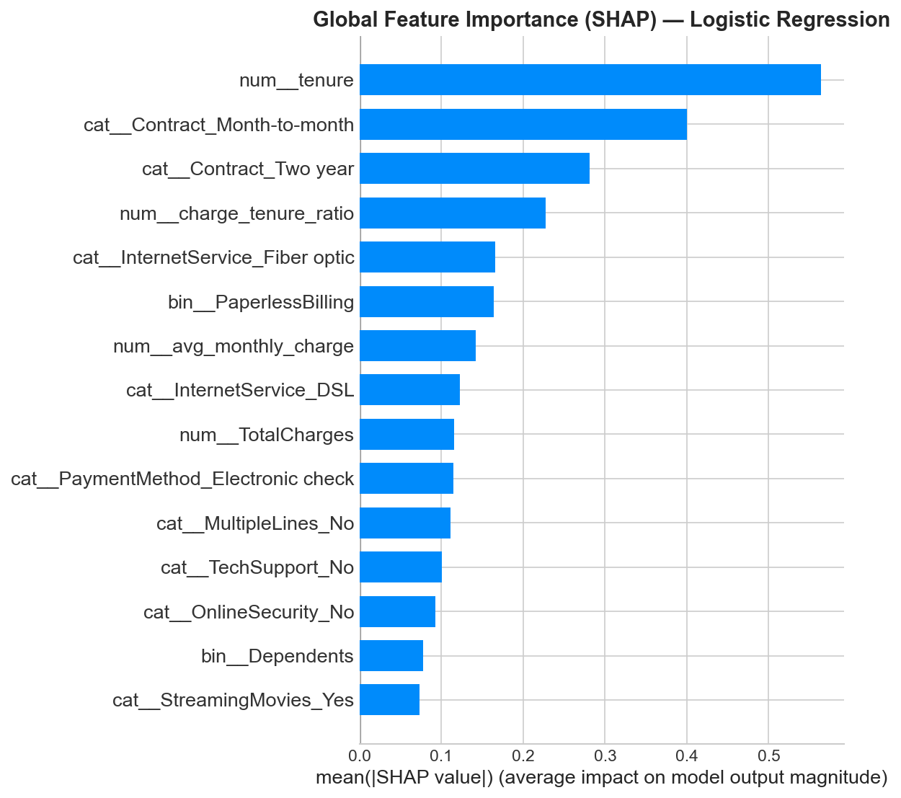 | 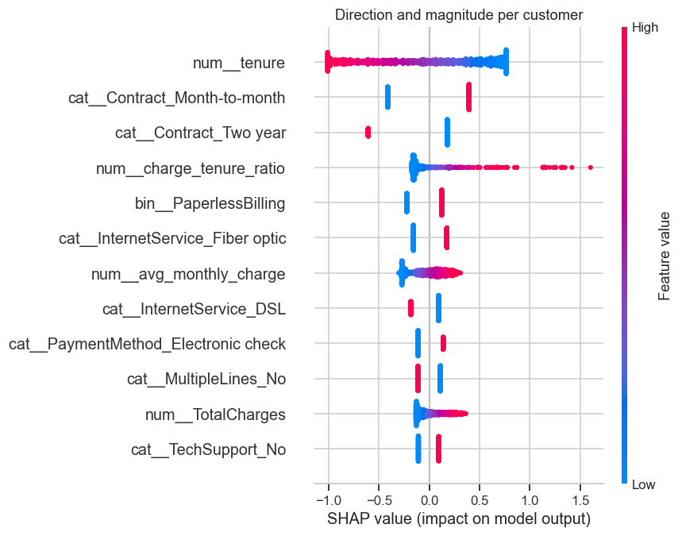 |
| 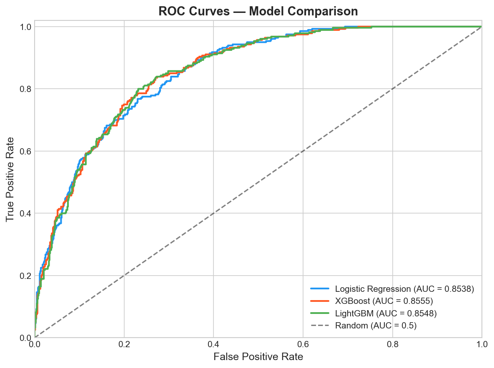 | 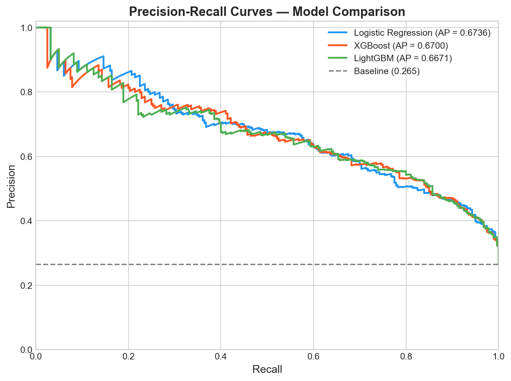 |
| 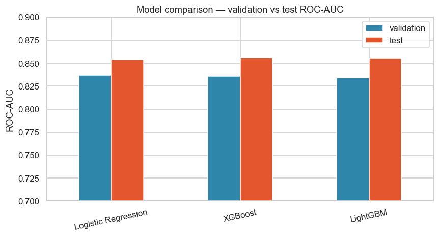 | 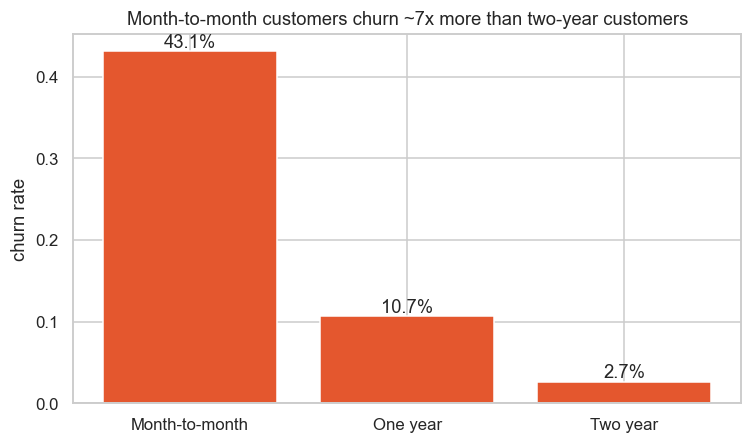 |
| 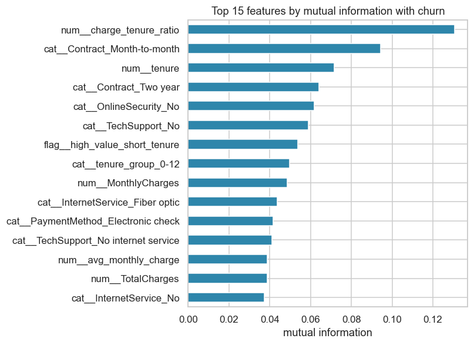 | 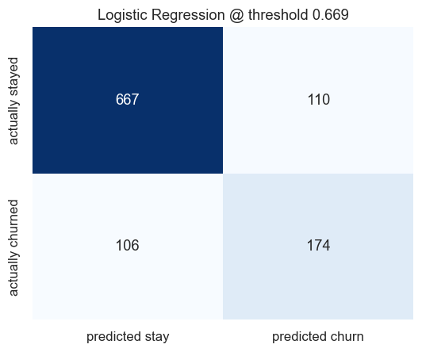 |
